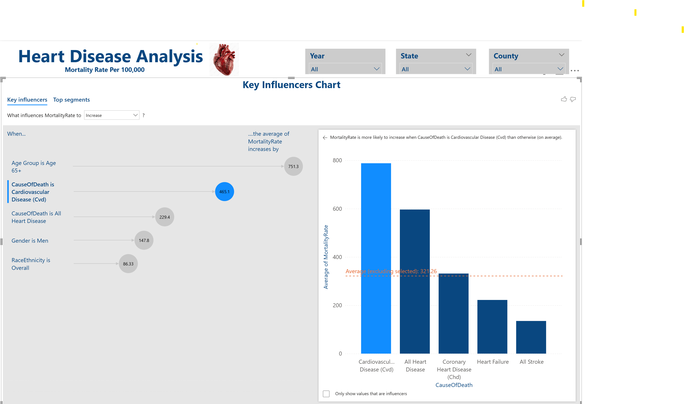
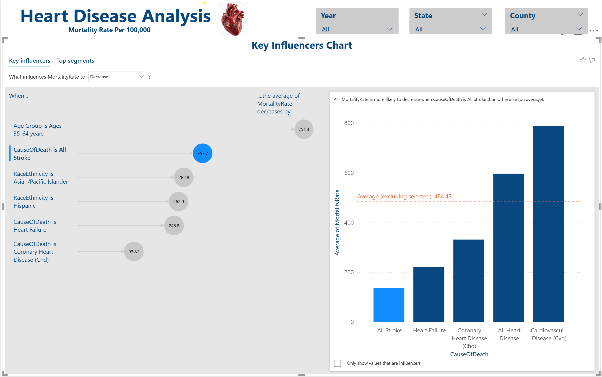
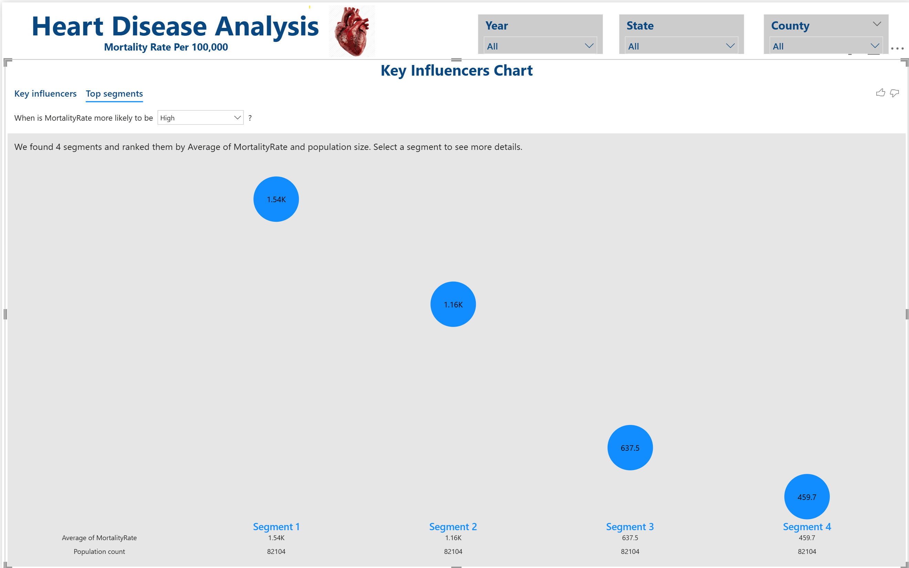
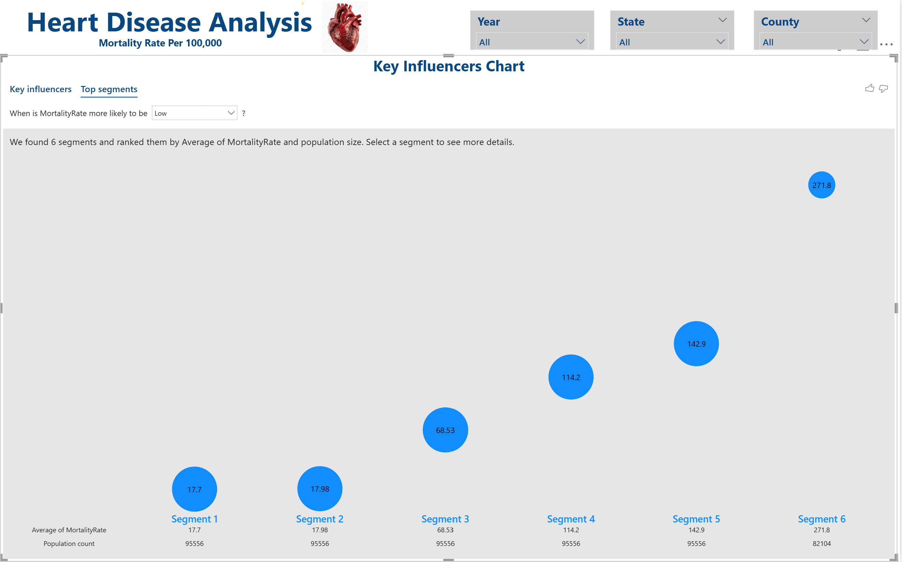

## Heart Disease Analysis

Mortality Trends in Heart Diseases: A 6-Year Analysis of Heart Disease and Stroke in the United States (2014-2019).
This project explores the trends and patterns of five major Heart-related conditions from 2014 to 2019 using public health data. These conditions are among the leading causes of death globally by analyzing their annual incidence or mortality rates.
The motivation behind this Analysis is to contribute to early detection, risk prediction and better decision making in the diagnosis and treatment of heart diseases. By leveraging the data, we aim to support healthcare professionals and improve patient outcomes, also aims to provide insights into how these diseases have evolved and what correlations or patterns may exist.

**Objectives** 
* To Analyze how mortality rates for heart disease and stroke varied across different demographic groups (age, gender, and race/ethnicity) and regions (states and counties) in those 6 years.
* Analyze and compare reported cases/deaths from five key heart-related diseases.
* Identify trends in five major heart-related conditions over six years.
* Compare prevalence and/or mortality rates across diseases annually.
* Visualize disease progression using graphs and charts.
* Explore possible correlations between different heart-related conditions.
* Provide actionable insights for researchers and health policymakers.

**Five Conditions Analyzed**

* Heart Disease – General term for various heart conditions.
* Stroke – Occurs when blood supply to the brain is interrupted or reduced.
* Cardiovascular Disease – Broad class of diseases involving the heart or blood vessels.
* Coronary Heart Disease – A type of heart disease caused by plaque buildup in coronary arteries.
* Heart Failure – A condition in which the heart can't pump enough blood to meet the body’s needs.

**Note: Although these terms may overlap clinically, they are treated as distinct causes in the dataset used for this analysis.**

**Dataset**

* Source: https://data.cdc.gov/api/views/7b9s-s8ck/rows.csv
* Years of Data Covered: 2014–2019
* Format: CSV
* Metrics Tracked: Cause of Death, Mortality rates per 100k, Gender, Race and Ethnicity, States and Counties.

**Quality of the data:** 
* The quality of data was unstructured in nature
* The data did have missing values and irrelevant columns

**Preprocessing of data:**
* All unwanted columns dropped
* Renamed the remaining columns
* Rows corresponding to missing values are dropped
* Duplicate rows are dropped

**Tools & Technologies**

* Python/Pandas - For exploration, normalizing and aggregation of the dataset, matplotlib, seaborn.
* Notebook Environment: Jupyter Notebook.
* Power BI – For creating Interactive dashboard.
* Git – For version control.

**Visualizations in Power BI**

* Line chart showing trend in Mortality rate over years.
* Tree Map to show overall Mortality rate by State.
* Column Charts to compare by States in the US.
* Pie, Donut, Bar and column charts to show the demographic analysis
* Filled Maps for Geographic distribution.
* AI Visual chart Key Influencers to identify key factors influencing average mortality rate.

**Key Findings**

* All Heart related deaths except Heart Failure are declined steadily between 2015-2019.
* Heart Failure had spiked from 2014-2019.
* Coronary heart disease declined steadily from 2014-2019.
* People 65+ make up nearly 92% of Heart disease deaths.
* Men have a higher Mortality rate when compared to Women.
* Highest mortality rates are concentrated in the southeastern U.S. especially Mississippi, Alabama, Arkansas, Oklahoma and Tennessee.

**Conclusion**

* The analysis gives a clear view of the evolution and impact of five major cardiovascular conditions over six years. It provides a data-driven foundation for understanding public health trends related to heart disease. These findings can help public health planners target resources effectively, focusing on high risk mortality rate ranges and vulnerable demographic groups.

**Future Improvements**

* Extend dataset beyond 2019.
* Predict future trends using machine learning.

* Heart Disease Analysis Power BI Dashboard Link : <a href ="https://app.powerbi.com/view?r=eyJrIjoiYzJjODBkMzctNDkwYi00NjdhLWIzMDAtMzk4OWI3ODc5YTZlIiwidCI6IjEwMWRhNTg3LTE4NDMtNGY1Mi04YjhhLTE3YjA2OWM2NmQzMyIsImMiOjJ9" >Heart_Disease_Analysis</a>

Last chart(Key Influencers) in Power BI will not show up in the published version as it is AI Visual and is not supported by Publishing.

* These charts explores the key influencers behind heart disease mortality rates. Our main goal is to understand where mortality is highest and what factors contribute most of it - to guide effective interventions and policy actions.

 

 

 

 

 

 

